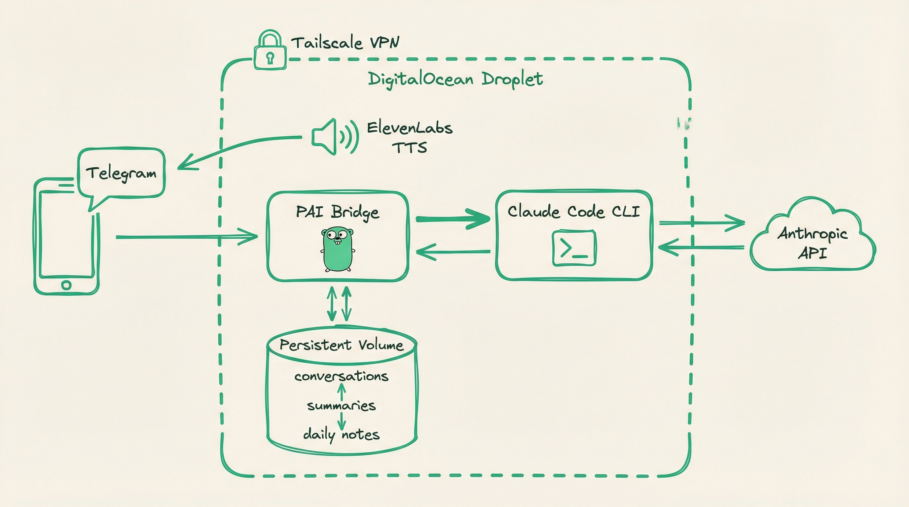

# PAI on DigitalOcean

Self-hosted Claude Code + Telegram Bridge on DigitalOcean, deployed via OpenTofu and GitHub Actions.



## Architecture

- **Compute**: DigitalOcean Droplet (s-2vcpu-4gb, Ubuntu 24.04)
- **Storage**: 10GB persistent DO Volume at `/mnt/pai-data`
- **Network**: Tailscale VPN mesh (zero inbound firewall rules, no public exposure)
- **Security**: Privilege separation (bridge=root, Claude=pai), metadata API blocked, UFW on tailscale0 only, fail2ban
- **Runtime**: Claude Code (native binary) + PAI Bridge (Go static binary) + [Personal AI Infrastructure](https://github.com/danielmiessler/Personal_AI_Infrastructure)
- **Interface**: Telegram bot via TelegramBridge daemon
- **Voice**: ElevenLabs TTS → OGG/OPUS → Telegram voice notes (optional)
- **Auth**: Claude subscription via OAuth token (no metered API billing)
- **State**: OpenTofu state stored in DO Spaces

## How It Works

```
You (Telegram) → Bot API → TelegramBridge (root) → Claude Code CLI (pai) → Anthropic API
                                                           ↓
                                                    /home/pai/projects (unprivileged)
```

The bridge is a lightweight Go binary (~10MB) that:
1. Long-polls Telegram for messages
2. Spawns `claude -p` subprocesses per message
3. Streams responses back to Telegram with HTML formatting
4. Manages conversation sessions with `--resume`
5. Logs conversations, generates summaries, and injects prior context into new sessions
6. Synthesizes voice responses via ElevenLabs when Claude outputs `VOICE:` directives

Claude Code runs against your subscription (Pro/Max), not metered API.

### Personal AI Infrastructure

This project builds on [Daniel Miessler's Personal AI Infrastructure](https://github.com/danielmiessler/Personal_AI_Infrastructure) (PAI), which provides the skill system, agent definitions, hooks, and memory architecture that Claude Code uses. PAI is installed on the persistent volume after the droplet is provisioned, and is managed by the agent itself across sessions.

### Message Queue

When a message arrives while Claude is already processing, the bridge queues it instead of spawning a second subprocess. Multiple queued messages are batched into a single follow-up prompt once the active response is delivered. Queue depth is capped at 20 messages.

## Memory System

The bridge implements multi-layer memory for session continuity:

```
/mnt/pai-data/memory/
  conversations/{userID}/{sessionID}.jsonl   # Every turn logged
  summaries/{userID}/{date}-{sessionID}.md   # Claude-generated session summaries
  daily/{userID}/{YYYY-MM-DD}.md             # Daily append-only notes
```

- **Conversation logging** — every message exchange is written to JSONL on the persistent volume
- **Pre-death flush** — when sessions timeout, get `/clear`ed, or the bridge shuts down, Claude summarizes the conversation into a durable markdown file
- **Cross-session context** — new sessions load the last 5 summaries + today's/yesterday's daily notes, so Claude knows what happened before
- **Daily reset** — sessions reset at 4 AM (configurable) instead of short idle timeouts

## Voice Notes

The bridge supports text-to-speech via ElevenLabs, delivered as Telegram voice notes with inline playback.

### How It Works

1. Claude includes a voice line on its own line — either `VOICE: Hello!` or `🗣️ PAI: Hello!`
2. The bridge extracts the voice line and strips it from the visible text
3. Calls ElevenLabs TTS API → receives MP3 audio
4. Converts MP3 → OGG/OPUS via `ffmpeg` (required for Telegram inline voice playback)
5. Sends via Telegram `sendVoice` API → user hears the voice note inline

### Configuration

Voice is configured in `settings.json` under `telegramBridge.voice`:

```json
{
  "telegramBridge": {
    "voice": {
      "enabled": true,
      "voice_id": "pDxcmDdBPmpAPjBko2mF",
      "model": "eleven_turbo_v2_5"
    }
  }
}
```

Requires:
- `ELEVENLABS_API_KEY` environment variable (loaded via systemd `EnvironmentFile`)
- `ffmpeg` installed on the host (included in cloud-init packages)
- `voice.enabled` set to `true` in settings.json

If the API key is missing or voice is disabled, the bridge silently skips voice synthesis — no errors, no degradation.

## Security Model

### Network Isolation
- **Zero inbound firewall rules** — DigitalOcean firewall blocks all inbound traffic
- **Tailscale-only SSH** — UFW allows SSH only on the `tailscale0` interface
- **No public SSH** — SSH key is provisioned for break-glass access via DO web console only

### Privilege Separation
- **Bridge runs as root** — required for spawning subprocesses with credential drop
- **Claude runs as `pai`** — unprivileged user created at boot; all Claude subprocesses run via `SysProcAttr.Credential` (setuid/setgid)
- **Home directory isolation** — `/home/pai` owned by `pai:pai`, working directory `/home/pai/projects`

### Secrets Management
- **Secrets in `EnvironmentFile`** — tokens stored in `/etc/pai/secrets.env` (0400 root:root), loaded via systemd `EnvironmentFile=` directive
- **Metadata API blocked** — `iptables -I OUTPUT 1 -d 169.254.169.254 -j REJECT` prevents exfiltration of user_data secrets after boot
- **No secrets in process environment** — tokens injected into `settings.json` at boot, not passed as env vars to Claude

### Systemd Hardening
- `ProtectKernelTunables=true` — read-only `/proc/sys`, `/sys`
- `ProtectKernelModules=true` — denies module loading
- `ProtectControlGroups=true` — read-only `/sys/fs/cgroup`

### Break-Glass Access
If Tailscale is down:
1. **DigitalOcean web console** — Droplets > pai-prod > Access > Launch Droplet Console
2. **Temporary firewall rule** — `doctl compute firewall add-rules <fw-id> --inbound-rules "protocol:tcp,ports:22,address:YOUR_IP/32"` (remove after use)

## Required GitHub Secrets

| Secret | Description | Where to Get |
|--------|-------------|--------------|
| `DO_TOKEN` | DigitalOcean API token | DO Dashboard → API → Generate New Token |
| `DO_SPACES_ACCESS_KEY` | Spaces access key for Terraform state | DO Dashboard → Spaces → Manage Keys |
| `DO_SPACES_SECRET_KEY` | Spaces secret key for Terraform state | DO Dashboard → Spaces → Manage Keys |
| `SSH_FINGERPRINT` | SSH key fingerprint for break-glass console access | DO Dashboard → Settings → Security → SSH Keys |
| `CLAUDE_OAUTH_TOKEN` | Claude Code OAuth token | Run `claude setup-token` locally |
| `TELEGRAM_BOT_TOKEN` | Telegram bot token | @BotFather on Telegram |
| `TELEGRAM_ALLOWED_USERS` | Telegram user IDs (quoted, comma-separated) | Send `/start` to @userinfobot |
| `TAILSCALE_AUTH_KEY` | Tailscale pre-auth key | login.tailscale.com/admin/settings/keys |
| `ELEVENLABS_API_KEY` | ElevenLabs API key for TTS voice notes (optional) | elevenlabs.io → Profile + API Key |

### Getting the Claude OAuth Token

```bash
# On your local machine (requires browser)
claude setup-token

# This outputs a token like: sk-ant-oat01-...
# Save it as the CLAUDE_OAUTH_TOKEN secret
```

### Telegram Allowed Users Format

The `TELEGRAM_ALLOWED_USERS` secret should be quoted user IDs, comma-separated:
```
"123456789", "987654321"
```

## Deployment

Push to `main` branch and trigger the workflow manually (workflow_dispatch).

### What Gets Deployed

1. DigitalOcean Droplet with Ubuntu 24.04 (zero inbound firewall rules)
2. Persistent volume attached and mounted at `/mnt/pai-data`
3. Tailscale VPN connection (hostname: `pai-prod`, SSH enabled)
4. Unprivileged `pai` user for Claude subprocess isolation
5. Claude Code installed as `pai` user (`/home/pai/.local/bin/claude`)
6. PAI Bridge binary (downloaded from latest GitHub release)
7. Bridge running as systemd service (root, with credential drop to `pai` for Claude)
8. Health check server on port 7777
9. ffmpeg for voice note synthesis (MP3 → OGG/OPUS conversion)
10. Metadata API blocked after setup completes

## Post-Deployment

### Verify Setup

```bash
# SSH via Tailscale
ssh root@pai-prod

# Check cloud-init completed
cloud-init status
cat /var/log/pai-setup.log

# Check bridge service
systemctl status pai-telegram-bridge
grep pai-bridge /var/log/syslog | tail -20

# Check health
curl http://localhost:7777/health

# Check Tailscale
tailscale status
```

### Service Management

```bash
# Restart bridge
systemctl restart pai-telegram-bridge

# View logs (bridge logs to syslog, not journal)
grep pai-bridge /var/log/syslog | tail -50

# Stop bridge
systemctl stop pai-telegram-bridge
```

### Telegram Bot Commands

The bot registers these commands automatically:

| Command | Description |
|---------|-------------|
| `/start` | Show bridge info |
| `/status` | Current session status |
| `/clear` | End current session |
| `/cd /path` | Change working directory |
| `/sessions` | List active sessions |

### Supported Input

- **Text messages** — regular chat
- **Photos** — image analysis
- **PDFs** — document analysis
- **Text files** — code, markdown, CSV, JSON, etc.

### Bridge Directives

Claude uses special directives to trigger bridge actions:

| Directive | Effect |
|-----------|--------|
| `SEND: /path/to/file` | Bridge delivers the file to the Telegram chat (photo or document) |
| `VOICE: Text to speak` | Bridge synthesizes speech via ElevenLabs and sends as a voice note |
| `🗣️ PAI: Text to speak` | Same as VOICE: — used by the PAI Algorithm's voice line |

## Cost

~$30/month infrastructure + your Claude subscription:
- Droplet (s-2vcpu-4gb): $24/mo
- Volume (10GB): $1/mo
- Backups: ~$5/mo

## Versioning

This project uses [CalVer](https://calver.org/) with the format `vYYYY.MM.PATCH`.

To create a release:
```bash
git tag v2026.02.1 && git push --tags
```

The patch number increments within a month: `v2026.02.1`, `v2026.02.2`, `v2026.02.3`, etc.

## Local Development

```bash
cd terraform
tofu init
tofu plan
tofu apply
```
